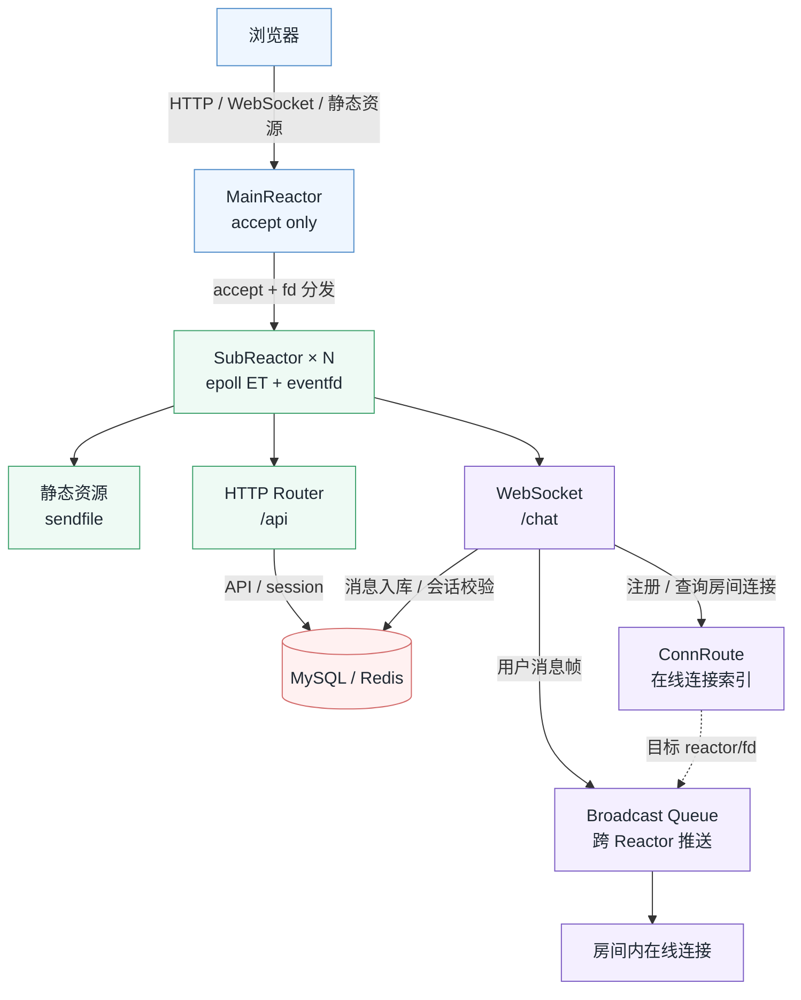
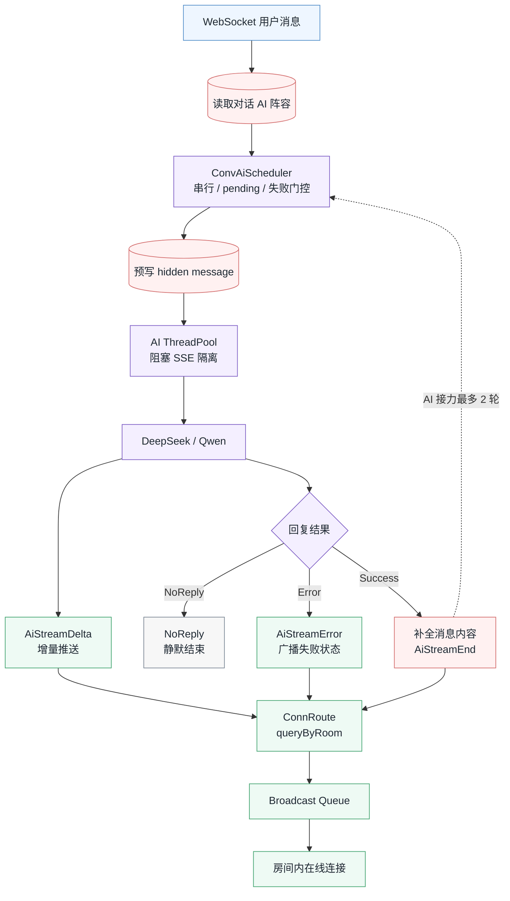

# Atrium

> 多人多 AI 实时协作平台 · C++ 自研后端

🌐 在线访问: http://lyctalk.com/ · 📦 GitHub: https://github.com/chen-lyc/Atrium

## 项目简介

Atrium 是一个多人、多 AI 共同参与的实时协作讨论平台。用户可以在房间中组织对话、邀请成员、配置参与讨论的 AI，并让讨论持续沉淀为后续可回看的思考上下文。

这个仓库的核心是 Atrium 的 C++ 后端：它负责把浏览器中的产品体验真正跑起来，包括静态资源托管、登录会话、业务 API、WebSocket 实时通信、AI 流式回复、MySQL/Redis 存储和基础性能优化。前端是 AI 辅助实现的 React/Vite 浏览器层，作为产品功能入口由后端直接托管。

## 设计初衷

Atrium 从产品体验出发，而不是先做一个孤立的服务器压测程序。多人讨论、AI 参与、房间与对话这些产品需求会反过来逼出真实的后端问题：身份如何统一、消息如何入库和广播、实时连接如何跨线程路由、AI 流式输出如何和普通聊天共存、前端资源如何由后端稳定交付。

→ [设计笔记](docs/DESIGN_NOTES.md) — 产品决策与取舍 reasoning

## 当前功能

- 账号注册、登录、Cookie `session_id` 会话和用户资料更新。
- Atrium 大厅、个人讨论室、普通房间、房间成员、邀请和好友关系。
- 房间主对话、子对话、消息历史分页、消息软删除和 `client_message_id` 去重。
- WebSocket `/chat` 实时通信，支持房间级广播和跨 Reactor 在线连接路由。
- DeepSeek / Qwen AI 参与对话，支持流式回复、静默无回复、错误事件、quota 和 token 用量统计。
- 后端直接托管 Vite 构建后的前端入口和静态资源。

## 架构设计意图

后端选择 C++ 自研，从网络 I/O 到业务协议走完整链路，而不是接一个现成 Web 框架。关键设计决策：

第一张图只看请求如何进入后端、如何被 SubReactor 分流，以及实时消息怎样找到目标连接。



第二张图单独展开 AI 回复链路：这里的重点不是“调用模型”，而是程序如何决定 AI 是否回复、什么时候回复、以及回复事件如何回到房间。



- **MainReactor 只做 accept** — 连接建立与业务 I/O 分离，避免相互阻塞。
- **SubReactor 线程内闭环** — 连接对象、定时器、广播队列不跨线程共享，减少锁竞争。
- **epoll ET + eventfd** — 边缘触发减少唤醒次数，eventfd 实现跨 Reactor 低成本通知。
- **ConnRoute 在线索引** — 维护 room/user 到 reactor/fd 的映射，供 WebSocket 广播、AI 流式事件和成员变更定位目标连接。
- **ConvAiScheduler 回复调度** — 以 `(conversation_id, ai_id)` 串行化 AI 任务，处理 pending、失败门控和 AI 接力，避免同一 AI 在同一对话中并发乱序回复。
- **AI ThreadPool 隔离** — Scheduler 只决定任务节奏，实际 provider SSE 调用在 AI worker 中执行，Start/Delta/End/Error 事件再回到 SubReactor 广播。

→ [后端架构](docs/BACKEND_ARCHITECTURE.md) — 运行时实现：Reactor 细节、HTTP/WebSocket 路径、AI 调度、存储模型

## 文档导航

**叙事文档**

| 文档 | 阅读目的 |
|---|---|
| [设计笔记](docs/DESIGN_NOTES.md) | 产品决策与取舍 reasoning |
| [后端架构](docs/BACKEND_ARCHITECTURE.md) | 运行时实现：Reactor、HTTP/WebSocket、AI 调度、存储 |
| [性能侦察](docs/PERFORMANCE_SCOUTING.md) | 压测方法论、历史数据与火焰图分析 |
| [疑难排查](docs/BUG_POSTMORTEM.md) | 开发期疑难问题根因分析与排查记录 |

**参考文档**

| 文档 | 阅读目的 |
|---|---|
| [API 参考](docs/API_REFERENCE.md) | 42 个业务 API 完整契约 |
| [实时协议](docs/REALTIME_PROTOCOL.md) | WebSocket 消息格式、流事件与广播语义 |

## 本地运行

### 环境依赖

- Ubuntu 22.04
- g++ 11.4.0
- MySQL 8.0.45
- Redis 6.0+
- protobuf 3.12.4
- Node.js / npm

```bash
sudo apt install g++ make default-libmysqlclient-dev libmysqlcppconn-dev mysql-server redis-server libhiredis-dev protobuf-compiler libprotobuf-dev libssl-dev
```

### 初始化与启动

```bash
# 创建 MySQL 用户并建库（代码中写死了 lyc / lYc@123456）
sudo mysql -e "
  CREATE USER IF NOT EXISTS 'lyc'@'127.0.0.1' IDENTIFIED BY 'lYc@123456';
  GRANT ALL PRIVILEGES ON webserver.* TO 'lyc'@'127.0.0.1';
  FLUSH PRIVILEGES;
"
mysql -u lyc -p -h 127.0.0.1 < database/schema.sql

# 构建前端资源
npm --prefix static install
npm --prefix static run build

# 重新生成 protobuf 文件（跨 protoc 版本兼容）
protoc --cpp_out=include message.proto
mv include/message.pb.cc src/

# 编译并启动后端
make
./build/server.out 127.0.0.1 8080 9090
```

如需启用 AI 回复：

```bash
export DEEPSEEK_API_KEY=...
export QWEN_API_KEY=...
```

### 基础检查

```bash
curl -i http://localhost:8080/index.html

curl -i -c /tmp/atrium.cookie \
  -d "username=test&password=123" \
  http://localhost:8080/api/register

curl -i -b /tmp/atrium.cookie http://localhost:8080/api/me
```

## 性能数据

测试环境：腾讯云 2vCPU / 2GB，回环压测。

| 指标 | 结果 | 说明 |
|---|---:|---|
| `GET /api/me` | 11K QPS | Cookie session + 当前用户读取 |
| `GET /api/rooms` | 2488 QPS | 登录态房间列表与关系数据读取 |
| WebSocket 房间广播 | 0 丢失 | 房间内实时消息广播可靠性检查 |

完整压测口径、历史数据和火焰图方法见 [性能侦察](docs/PERFORMANCE_SCOUTING.md)。
